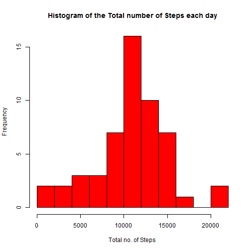
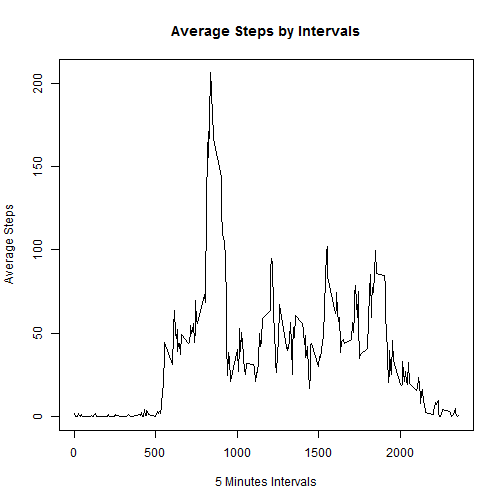
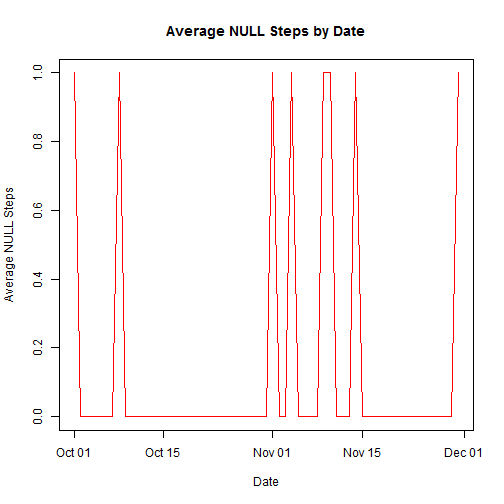
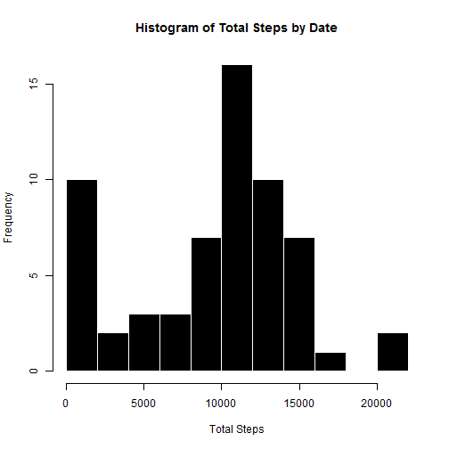
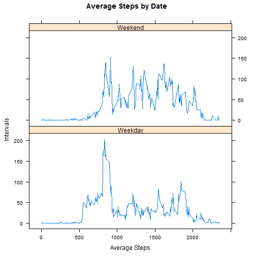

Reproducible Research - Week2 Project
=====================================
By: Aya Taha


In this assignment, we will use the activity data .You can get the data from [here](https://d396qusza40orc.cloudfront.net/repdata%2Fdata%2Factivity.zip)

First load the activity data and transform the Date column


```r
activity <- read.csv("activity.csv")
activity <- transform(activity , date= as.Date(date))
```

### Assignment

### What is mean total number of steps taken per day?


```r
# Load the library dplyr
library(dplyr)
#Calculating the total steps for each day
q1<- activity %>% group_by(date) %>% summarize(total_steps= sum(steps))

# Plotting a Histogram for the total steps each ady
hist(q1$total_steps , col="red" ,
     main = "Histogram of the Total number of Steps each day" ,
     xlab = "Total no. of Steps" , breaks = 10 )
```




```r
Steps_mean <- mean(q1$total_steps , na.rm = T)
Steps_median <- median(q1$total_steps , na.rm = T)
```

Steps Mean = 1.0766189 &times; 10<sup>4</sup>  
Steps Median = 10765  
    
======================================================================================      
### What is the average daily activity pattern?


```r
#summarize the average steps by the intervals for all the days
q2 <- activity %>% group_by(interval) %>% 
        summarize(average_steps=mean(steps , na.rm=T))
# Plot the line chart 
plot(q2$interval , q2$average_steps , type="l" , xlab = "5 Minutes Intervals",
     ylab="Average Steps" ,main = "Average Steps by Intervals" )
```



```r
max_average_steps <- q2$interval[q2$average_steps==max(q2$average_steps)]
```

As we could see from the chart , that the **835** interval has the maximum average steps.

======================================================================================  
  
### Imputing missing values
  

```r
sum_null <- sum(is.na(activity$steps))
```
  
From the activity data we could reveal that the No. of missing values = **2304 **  
  

```r
#Calculating the average of missing values by date to define the pattern
q3 <- activity %>% group_by(date) %>% summarize(sum_null= sum(is.na(steps))/288 )

# Plot a line chart for viewing the result
plot(q3$date , q3$sum_null , type="l" , xlab = "Date",
      ylab="Average NULL Steps" ,main = "Average NULL Steps by Date", col="red" )
```


  
  
Replace the **NULL** with **ZEROs**:

```r
NoNA_activity <- activity %>% mutate(steps=replace(steps,which(is.na(steps)),0))

# Summarize the creates table and get the total steps grouped by date
sum_steps <- NoNA_activity %>% group_by(date) %>% summarize(ttl_steps = sum(steps))

hist(sum_steps$ttl_steps , col="black", border = "white" , xlab="Total Steps" , main = "Histogram of Total Steps by Date" , breaks = 10)
```



  
  

```r
Steps_mean_NONA = mean(sum_steps$ttl_steps)
Steps_median_NONA = median(sum_steps$ttl_steps)
```

After removing NAs  
Steps Mean = 9354.2295082  
Steps Median = 1.0395 &times; 10<sup>4</sup>

  
As we could see and compare the results with the previous charts -at the first of the document - we could see that most of the dates pulled downs to zeros which are the data imputed from NAs to Zeros  
  
======================================================================================      
  
### Are there differences in activity patterns between weekdays and weekends?


```r
#Create a new factor of weekDays column
NoNA_activity <- NoNA_activity %>% mutate(WeekDays=as.factor(ifelse( weekdays(date) %in% c("Saturday","Sunday") , "Weekend","Weekday" )))

# Summarizing the data group by the weekdays and the intervals
q4 <- NoNA_activity %>% group_by(WeekDays , interval ) %>% summarise(avg_steps = mean(steps))

library(lattice)

xyplot(avg_steps ~ interval | WeekDays , data=q4 , type="l" , layout=c(1,2) , xlab="Average Steps" , ylab="Intervals" , main="Average Steps by Date ")
```




